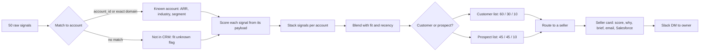
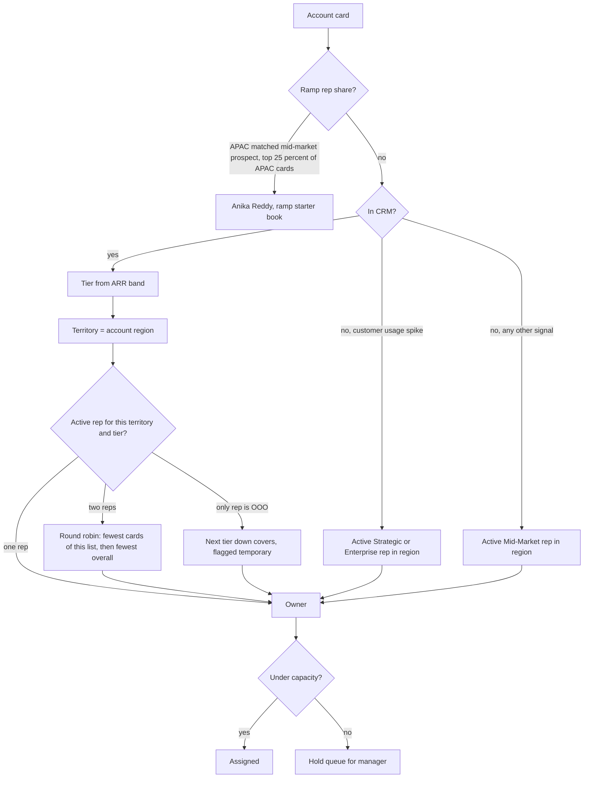
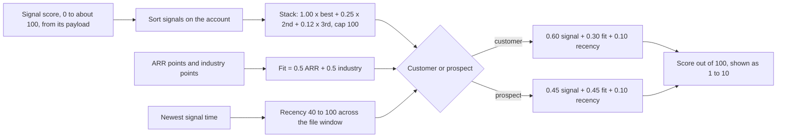

# Signal Router: how it works

A visual reference for routing and scoring. Every number here is a constant in [`router/weights.py`](router/weights.py), so this page, the code, and the "Why this score" panel on each card always agree. The reasoning lives in [DESIGN.md](DESIGN.md).

## 1. End to end

50 signals become 44 account cards: 13 customers and 31 prospects. 16 signals don't match an account in the CRM.

## 2. Routing decision tree

| ARR band | Tier |
|---|---|
| `$250M+` | Strategic |
| `$50M-$250M` | Enterprise |
| `$10M-$50M`, `$1M-$10M`, `<$1M` | Mid-Market |
| Not in CRM | Unknown |

| Seller | Territory | Tiers | Status | Cards (customers / prospects) | Why |
|---|---|---|---|---|---|
| Alex Rivera | US-East | Strategic, Enterprise | active | 0 / 2 | Helix Build; round robin with Chris |
| Chris Walsh | US-East | Strategic | active | 1 / 1 | Round robin; took Meridian usage spike |
| Priya Shah | US-East | Mid-Market | active | 1 / 5 | Mid-market plus unmatched US-East |
| Marcus Lee | US-West | Strategic | active | 0 / 0 | No US-West Strategic signals |
| Jordan Kim | US-West | Enterprise | active | 0 / 1 | Parallax Genomics |
| Sam Chen | US-West | Mid-Market | active | 0 / 4 | Unmatched US-West |
| Diego Morales | US-Central | Enterprise, Mid-Market | active | 5 / 7 | Includes 3 Strategic cards covering Rachel |
| Rachel Park | US-Central | Strategic | **OOO** | 0 / 0 | Out; Diego covers |
| Tom O'Brien | EMEA | Strategic, Enterprise | active | 1 / 4 | |
| Lena Vogt | EMEA | Mid-Market | active | 1 / 3 | |
| Hiro Tanaka | APAC | All three | active | 4 / 2 | Keeps Thorn Data and every APAC customer |
| Anika Reddy | APAC | none listed | **ramp** | 0 / 2 | Chert Scale, Osprey Grid (2 of 8 APAC cards) |

## 3. Scoring flow

### Blend and stack

| | Signal | Fit | Recency |
|---|---|---|---|
| Customer | 60% | 30% | 10% |
| Prospect | 45% | 45% | 10% |

| Signal on the account | Counts |
|---|---|
| Strongest | 100% |
| 2nd | 25% |
| 3rd | 12% |
| 4th and later | 0% |

Stacked signals cap at 100. The card shows anything above the cap as a negative "Signal cap" line, so the lines still add up.

### Signal formulas

Every signal also gets the **severity hint: high +5, medium 0, low −5**.

| Signal | Formula | Range in this file |
|---|---|---|
| Usage spike | 70 + min(20, pct increase / 20) + volume | 79 to 91 |
| Intent | 50 + intensity × 30 + topic + source | 71 to 89 |
| Competitor | action + competitor + freshness | 44 to 95 |
| Funding | round + min(15, $M / 10) | 35 to 74 |
| Job change | title points (arrival) or flat (departure) | 28 to 73 |

**Intent topic and source**

| Topic | Points | | Source | Points |
|---|---|---|---|---|
| GPU alternatives, inference cost, serving latency, fine-tuning, function calling, open-source hosting | +10 | | G2, 6sense | +6 |
| RAG pipeline infrastructure | +4 | | Harmonic | +3 |
| Anything else | 0 | | Web traffic | 0 |

**Competitor**

| Action | Points | | Competitor | Points | | Days since last signal | Points |
|---|---|---|---|---|---|---|---|
| Pricing page visit | 82 | | Together AI | +6 | | ≤ 7 | +10 |
| Comparison search | 74 | | Replicate | +6 | | ≤ 14 | +5 |
| Docs read | 58 | | Anyscale | +6 | | ≤ 21 | 0 |
| Benchmark download | 46 | | OpenAI | 0 | | > 21 | −8 |

**Funding round**

| Seed Extension | Series A | Series B | Series C | Series D |
|---|---|---|---|---|
| 32 | 42 | 50 | 58 | 66 |

Plus `min(15, amount_usd_m / 10)`.

**Job change**

| Change | Points |
|---|---|
| Arrived: CTO, Head of AI | 78 |
| Arrived: VP Infrastructure, Director of ML Platform, Chief Architect | 68 |
| Arrived: Staff ML Engineer | 40 |
| Departed at a customer (save play) | 48 |
| Departed at a prospect | 28 |

**Usage volume** (requests in 7 days): ≥ 40k +8, ≥ 20k +5, ≥ 10k +3.

### Fit

| ARR band | Points |
|---|---|
| `$250M+` | 90 |
| `$50M-$250M` | 75 |
| `$10M-$50M` | 60 |
| `$1M-$10M` | 45 |
| `<$1M` | 25 |
| Not in CRM | 50 |

| Industry | Points | Fireworks proof point |
|---|---|---|
| DevTools | 100 | Cursor, Sourcegraph, Vercel |
| AI/ML | 88 | Genspark, rLLM, model builders |
| HealthTech | 76 | Heidi Health |
| Logistics | 70 | DoorDash, Uber |
| Media | 58 | Quora |
| Cybersecurity | 55 | Spend logic: high-volume classification workloads |
| Telecom | 48 | Spend logic: support and contact-center volume (Cresta) |
| FinTech | 36 | Regulated buyer; slower cycle |
| E-commerce | 30 | Upwork, search and recommendations |
| InsurTech | 28 | Regulated buyer; slower cycle |
| HR Tech | 22 | |
| LegalTech | 20 | |
| Manufacturing | 18 | |
| Education | 12 | |
| Energy | 10 | |
| Not in CRM | 40 | |

## 4. Worked example: Caliber Robotics

Customer, Logistics, `$250M+`, US-Central Strategic. Rachel Park is OOO, so Diego Morales covers.

| Points | Line | Rule |
|---|---|---|
| +46.5 | Intent: fine-tuning platform (Harmonic, 0.48) | 77.4 × 1.00 stack × 0.60 |
| | | 50 base + 14.4 intensity + 10 direct topic + 3 Harmonic + 0 medium |
| +9.8 | Funding: Series C, $25M (2nd signal) | 65.5 × 0.25 stack × 0.60 |
| | | 58 Series C + 2.5 amount + 5 high |
| +13.5 | ARR `$250M+` | 90 × 0.50 × 0.30 |
| +10.5 | Industry: Logistics | 70 × 0.50 × 0.30 |
| +6.9 | Recency: newest signal Aug 13 | 69.1 × 0.10 |
| **87.2** | **Total, shown as 8.7** | |

## 5. Ranking tradeoffs, from the real output

| Account | List, rank | Why it lands there |
|---|---|---|
| Lupine Scale | Prospect #3 | Three signals stack to 105, capped at 100; E-commerce fit holds it below Thorn and Chert |
| Meridian Robotics vs Cedar Defense | Customer #2 vs #6 | Both usage spikes. Payload beats severity hint: +354% marked low outranks +78% marked high |
| Alabaster Mind vs Iris Secure | Prospect #6 vs #8 | Strong fit (DevTools, `$250M+`) on one funding event beats a hot Together AI comparison with no CRM data. Known first-draft tradeoff |
| Chert Scale, Osprey Grid | Prospect #2, #5 | Small AI-native accounts in the top industries rise by design |
