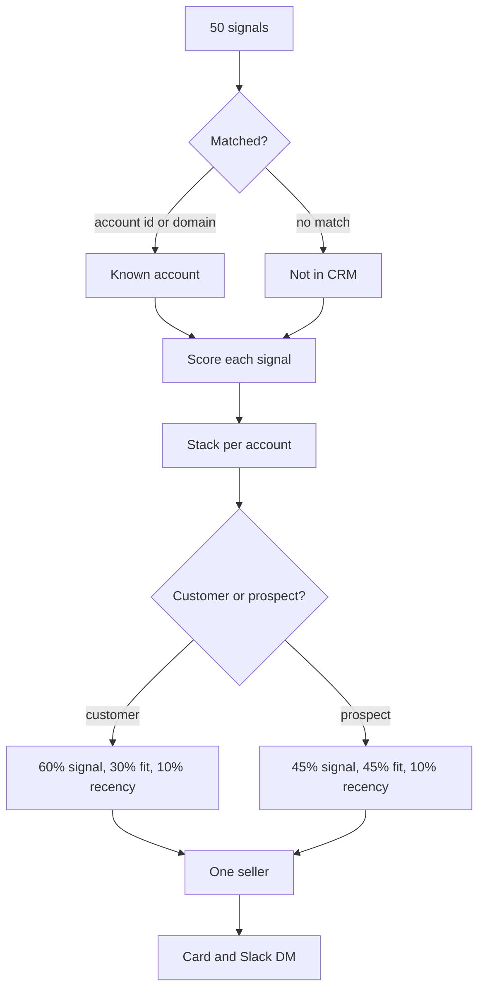
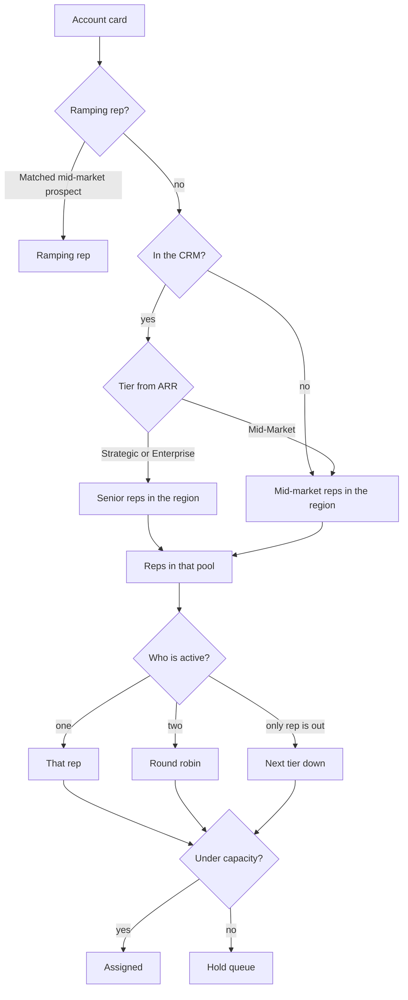
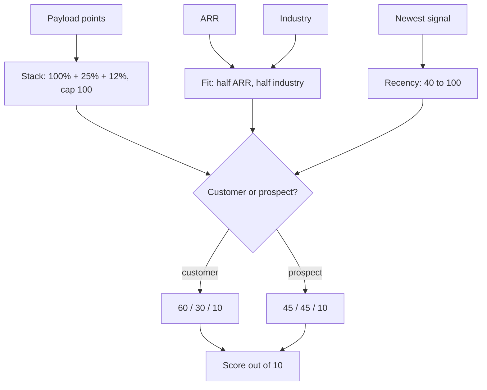

# Signal Router: how it works

A visual reference for routing and scoring. Every number here is a constant in [`router/weights.py`](router/weights.py), so this page, the code, and the "Why this score" panel on each card always agree. The reasoning lives in [DESIGN.md](DESIGN.md).

## 1. End to end

50 signals become 44 account cards: 13 customers and 31 prospects. 16 signals don't match an account in the CRM.

## 2. Routing decision tree

The ramping rep stops here. Every other account picks a pool, and that pool continues through the same steps.

Round robin picks the rep with the fewest cards on that list, then the fewest overall. Coverage for an out-of-office rep is flagged as temporary.

| ARR band | Tier |
|---|---|
| `$250M+` | Strategic |
| `$50M-$250M` | Enterprise |
| `$10M-$50M`, `$1M-$10M`, `<$1M` | Mid-Market |
| Not in CRM | Unknown |

## 3. Scoring flow

### Blend and stack

| | Signal | Fit | Recency |
|---|---|---|---|
| Customer | 60% | 30% | 10% |
| Prospect | 45% | 45% | 10% |

**Ranking: how much each signal on the same account counts.** Highest first. A fourth signal adds nothing, so a pile of weak signals cannot outrank one strong one. The stack caps at 100, and the card shows anything above the cap as a negative "Signal cap" line.

| Rank | Signal on the account | Counts | Why this rank |
|---|---|---|---|
| 1 | Strongest | 100% | This is the thing that happened |
| 2 | 2nd | 25% | Extra evidence. It does not get an equal vote |
| 3 | 3rd | 12% | A little more conviction |
| 4 | 4th and later | 0% | Ignored |

### Rankings inside a signal

Every table below is a ranking, highest first. **Why this rank** is the reason that row sits above the next one. Every signal also gets the severity ranking at the bottom of this section.

**Ranking: signal type**

| Rank | Signal | Formula | Range in this file | Why this rank |
|---|---|---|---|---|
| 1 | Usage spike | 70 + min(20, pct increase / 20) + volume | 79 to 91 | Observed usage on a paying customer. A fact, not an inference |
| 2 | Competitor | action + freshness | 38 to 89 | They are shopping a vendor now. A pricing page can outscore usage; a stale benchmark sits much lower, which is why the range is wide |
| 3 | Intent | 50 + intensity × 30 + topic + source | 71 to 89 | They are researching what we sell. Weaker than a live evaluation |
| 4 | New hire, arrived | title points | up to 83 | A new budget owner revisits the stack in the first 90 days |
| 5 | Funding | round + min(15, $M / 10) | 35 to 74 | Budget timing, not intent |
| 6 | Departure | 0.6 × the same title's arrival points | 24 to 47 | The seat will be filled, but the buyer is not there yet |

**Ranking: intent topic.** Topic points measure product fit.

| Rank | Topic | Points | Why this rank |
|---|---|---|---|
| 1 | GPU alternatives, inference cost, serving latency, fine-tuning, function calling, open-source hosting | +10 | This is the product Fireworks sells |
| 2 | RAG pipeline infrastructure | +4 | Adjacent. They may need retrieval, not necessarily our inference |
| 3 | Anything else | 0 | The topic shows no product fit |

**Ranking: intent source.** Source points measure confidence in the data, separate from the topic.

| Rank | Source | Points | Why this rank |
|---|---|---|---|
| 1 | G2, 6sense | +6 | Purpose-built in-market data |
| 2 | Harmonic | +3 | Broad coverage, not an evaluation of who is buying |
| 3 | Web traffic | 0 | The noisiest source, so it adds nothing |

**Ranking: competitor action.** How close the visit is to a buying decision.

| Rank | Action | Points | Why this rank |
|---|---|---|---|
| 1 | Pricing page visit | 82 | They are comparing cost. Closest to a deal |
| 2 | Comparison search | 74 | They are shopping vendors |
| 3 | Docs read | 58 | They are learning the product. Earlier in the cycle |
| 4 | Benchmark download | 46 | Research. Furthest from a decision |

Which competitor they looked at does not change the score. Together AI, Replicate, Anyscale, and OpenAI all score the same.

**Ranking: competitor freshness.** Days since their last signal.

| Rank | Days since last signal | Points | Why this rank |
|---|---|---|---|
| 1 | 7 or fewer | +10 | In market this week |
| 2 | 8 to 14 | +5 | Still recent |
| 3 | 15 to 21 | 0 | No boost |
| 4 | More than 21 | −8 | Stale. The evaluation may already be over |

**Ranking: funding round.** A later round is a larger budget event. This is timing, not proof they want Fireworks. A bigger check adds `min(15, $M / 10)` on top of the round.

| Rank | Round | Points | Why this rank |
|---|---|---|---|
| 1 | Series D | 66 | Most capital in this file |
| 2 | Series C | 58 | One round smaller than Series D |
| 3 | Series B | 50 | One round smaller than Series C |
| 4 | Series A | 42 | One round smaller than Series B |
| 5 | Seed Extension | 32 | Earliest round here, so the smallest budget signal |

**Ranking: job change, by title.** `arrived` means they joined the company on that row. `departed` means they left it. A departure scores 0.6 × the same title, because the seat will be filled but the new person cannot evaluate yet.

| Rank | Title | Arrived | Departed | Why this rank |
|---|---|---|---|---|
| 1 | CTO, Head of AI | 78 | 46.8 | Owns the budget and the stack decision |
| 2 | VP Infrastructure, Director of ML Platform, Chief Architect | 68 | 40.8 | Owns the platform decision, one level from the budget |
| 3 | Staff ML Engineer | 40 | 24 | Does not buy. Can still influence a build, so it scores |

**Ranking: usage volume.** Requests in 7 days. This keeps a huge percent increase on a tiny base from looking like a large account.

| Rank | Requests in 7 days | Points | Why this rank |
|---|---|---|---|
| 1 | 40,000 or more | +8 | Production scale |
| 2 | 20,000 to 39,999 | +5 | Real traffic |
| 3 | 10,000 to 19,999 | +3 | Enough to matter |
| 4 | Under 10,000 | 0 | The percent increase can be large on a small base |

**Ranking: severity hint.** A small adjustment. The payload still sets the score: Meridian at +354% labeled low outranks Cedar at +78% labeled high.

| Rank | Hint | Points | Why this rank |
|---|---|---|---|
| 1 | High | +5 | The source marked it urgent |
| 2 | Medium | 0 | No adjustment |
| 3 | Low | −5 | The source marked it weak |

### Fit rankings

**Ranking: ARR.** Larger book, higher points. Missing ARR is neutral, not a rank.

| Rank | ARR band | Points | Why this rank |
|---|---|---|---|
| 1 | `$250M+` | 90 | Largest accounts. Inference spend can be a real line item |
| 2 | `$50M-$250M` | 75 | Enterprise budget |
| 3 | `$10M-$50M` | 60 | Mid-market, with room to grow |
| 4 | `$1M-$10M` | 45 | Small, and real |
| 5 | `<$1M` | 25 | Smallest book. A hot signal can still carry it |
| — | Not in CRM | 50 | Unknown. Neutral, so missing ARR neither promotes nor buries the signal |

**Ranking: industry.** Anchored on public Fireworks customers, not on how many accounts each industry has in this file. Missing industry is neutral, not a rank.

| Rank | Industry | Points | Why this rank |
|---|---|---|---|
| 1 | DevTools | 100 | Closest to the product. Cursor, Sourcegraph, and Vercel run production inference on Fireworks |
| 2 | AI/ML | 88 | Model builders, and usage grows with them. Genspark, rLLM |
| 3 | HealthTech | 76 | Production clinical workload. Heidi Health |
| 4 | Logistics | 70 | High request volume. DoorDash, Uber |
| 5 | Media | 58 | Consumer-scale open models. Quora |
| 6 | Cybersecurity | 55 | High-volume classification workloads |
| 7 | Telecom | 48 | Support and contact-center volume. Cresta |
| 8 | FinTech | 36 | Regulated buyer, slower cycle |
| 9 | E-commerce | 30 | Search and recommendations. Upwork |
| 10 | InsurTech | 28 | Regulated buyer, slower cycle |
| 11 | HR Tech | 22 | No public Fireworks customer. Inference is a feature, not the product |
| 12 | LegalTech | 20 | No public customer. Narrower purchase |
| 13 | Manufacturing | 18 | No public customer. Little production model serving in this motion |
| 14 | Education | 12 | No public customer. Low spend and a slow cycle |
| 15 | Energy | 10 | No public customer. Weakest fit in this book |
| — | Not in CRM | 40 | Unknown. Neutral, below the industries with a logo and above the bottom of the ladder |

## 4. Worked example: Caliber Robotics

Customer, Logistics, `$250M+`, US-Central Strategic. Rachel Park is OOO, so Diego Morales covers.

| Points | Line | Rule |
|---|---|---|
| +46.5 | Intent: fine-tuning platform (Harmonic, 0.48) | 77.4 × 1.00 stack × 0.60 77.4 = 50 base + 14.4 intensity + 10 direct topic + 3 Harmonic + 0 medium |
| +9.8 | Funding: Series C, $25M (2nd signal) | 65.5 × 0.25 stack × 0.60 65.5 = 58 Series C + 2.5 amount + 5 high |
| +13.5 | ARR `$250M+` | 90 × 0.50 × 0.30 |
| +10.5 | Industry: Logistics | 70 × 0.50 × 0.30 |
| +6.9 | Recency: newest signal Aug 13 | 69.1 × 0.10 |
| **87.2** | **Total, shown as 8.7** | 46.5 + 9.8 + 13.5 + 10.5 + 6.9 |

## 5. Account ranking, from the real output

| Account | List, rank | Why it lands there |
|---|---|---|
| Lupine Scale | Prospect #3 | Three signals stack to 105, capped at 100; E-commerce fit holds it below Thorn and Chert |
| Meridian Robotics vs Cedar Defense | Customer #2 vs #6 | Both usage spikes. Payload beats severity hint: +354% marked low outranks +78% marked high |
| Alabaster Mind vs Iris Secure | Prospect #5 vs #10 | Strong fit (DevTools, `$250M+`) on one funding event beats a hot Together AI comparison with no CRM data. Known first-draft tradeoff |
| Chert Scale, Osprey Grid | Prospect #2, #6 | Small AI-native accounts in the top industries rise by design |
